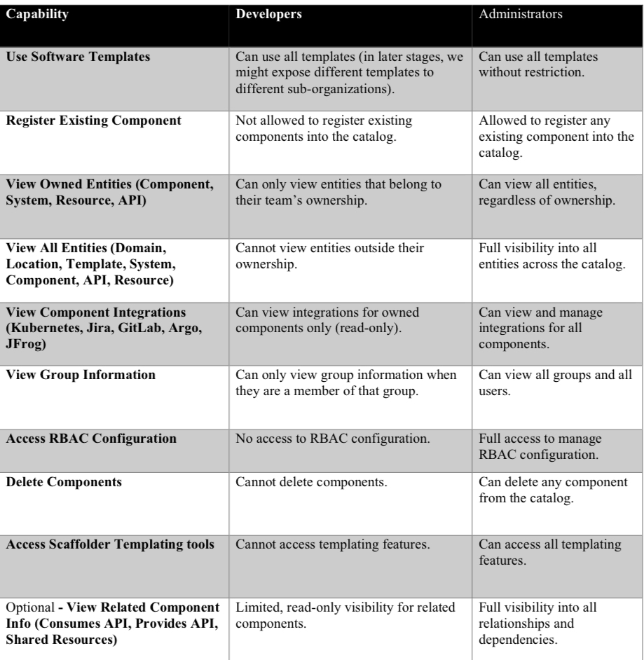

# POC 82 – RHDH RBAC Capabilities

This repository documents **Proof of Concept 82**, which focuses on testing and demonstrating the **RBAC (Role Based Access Control) capabilities** within **Red Hat Developer Hub (RHDH)**.  

## Objective
• Validate that RHDH can enforce role based access at different levels.  
• Test integration of groups and permissions.  
• Ensure default deny behavior with explicit role based allowances.  
• Provide clear mapping of requirements to implementation.

## Requirements Overview
The following diagram summarizes the RBAC requirements identified for this POC:

## Tested versions
• RHDH: **1.7.0**  
• Deployment method: **Operator on OpenShift**  
• Backstage and plugin bundles: versions as provided from the rhdh 1.7.0 image

## Requirements traceability
| Capability | Implementation in this repo | How to validate |
|---|---|---|
| Use Software Templates | `rbac-policies-cm.yaml` grants developers: `scaffolder.action.execute allow`, `scaffolder.template.parameter.read allow`, `scaffolder.template.step.read allow`, `scaffolder.template.management deny`. Admins have full scaffolder rights. | Sign in as a developer. Open **Create** and run any template. Confirm execution succeeds. Confirm no template management UI is available. |
| Register Existing Component | Developers: `catalog.location.create deny`. Administrators: `catalog.location.create allow`. | As developer, open **Register existing component** and attempt to register a location. Expect a permission error. As admin, repeat and succeed. |
| View Owned Entities only | Conditional policy in `rbac-conditions-cm.yaml` with `result: CONDITIONAL` for `role:default/developers` on `catalog-entity` grants read and update when the user is owner or member of the owning group. | As developer who owns `component:default/foo`, open it and confirm visibility and edit actions. Attempt to open a non owned entity and expect a permission error. |
| View All Entities (admins) | Administrators have full catalog read, create, delete, refresh in `rbac-policies-cm.yaml`. | Sign in as admin and browse several entities. Confirm full visibility and delete is enabled. |
| View Component Integrations for owned components only | Developers have read for Kubernetes and use for GitLab proxy. Visibility is effectively gated by entity read ownership and cluster side RBAC. | From an owned component page, open **Kubernetes** and **GitLab** tabs. Confirm read works. Try to navigate to a non owned entity page and confirm it is not visible, so its integrations are not reachable. |
| View Group Information | **Known gap.** In this POC developers can view all **Group** entities. Current RHDH 1.7 capabilities do not support restricting visibility of Groups by actual membership. | As developer, open several Group entities including ones you are not a member of. Confirm they are visible. As admin, confirm full visibility. |
| Access RBAC Configuration | Developers: `policy.entity.* deny`. Administrators: `policy.entity.* allow`. | As developer, try to open the Permissions or Policy UI and expect a permission error. As admin, confirm full access. |
| Delete Components | Developers: `catalog.entity.delete deny`. Administrators: `catalog.entity.delete allow`. | As developer, attempt to delete any component and expect a permission error. As admin, delete a test component. |
| Optional: View Related Component Info | Relation visibility follows the same conditional read. | From an owned component page, open the relations graph or related tabs. Confirm only allowed entities appear. |

## Validation script
1. Sign in as a **developer** who owns one test component and belongs to one team group.  
2. Open the owned component. Confirm you can view details, run a template, read TechDocs if present, and see integrations on that page.  
3. Try to open a component you do not own. Expect a permission error.  
4. Try **Register existing component**. Expect a permission error.  
5. Open several **Group** entities, including ones you are not a member of. Confirm they are all visible.  
   ⚠️ This reflects a known gap in RHDH 1.7: group visibility cannot be restricted by membership in this POC.  
6. Sign out and sign in as an **administrator**.  
7. Browse any entity. Confirm full visibility including **Delete** and **Refresh** actions.  
8. Open **Permissions** or **Policy** UI. Confirm full access as admin.

## Limitations and notes
• **Known gap.** Group visibility is not restricted by membership in this POC. Developers can view all Group entities.  
• Current RHDH 1.7 capabilities do not support relation based enforcement for Groups.  
• The Kubernetes and Topology plugins are configured with a single service account that has cluster wide read access and do not impersonate end users. Effective scoping in this POC is achieved by showing these panels only on owned entity pages.  
• Developers do not have access to RBAC configuration or policy browsing. This is by design for this POC.  
• Search results inherit visibility from the source plugins and the permission framework. There is no separate search permission in this POC.

## Configuration variables
| Variable | Meaning | Example |
|---|---|---|
| `APP_BASE_URL` | External URL for the Backstage frontend | `https://backstage.example.com` |
| `BACKEND_BASE_URL` | External URL for the Backstage backend | `https://backstage.example.com` |
| `GITLAB_HOST` | GitLab host including scheme | `https://gitlab.example.com` |
| `GITLAB_CLIENT_ID` | OAuth client identifier | `abc123` |
| `GITLAB_CLIENT_SECRET` | OAuth client secret | `****` |
| `GITLAB_TOKEN` | Personal access token for integrations | `****` |
| `SESSION_SECRET` | Backstage session secret | `****` |

## Next Steps
• Implement the RBAC model in the RHDH environment.  
• Validate that only authorized roles can access defined plugins and actions.  
• Document outcomes and gaps for feedback.

---

**Status:** Work in progress
